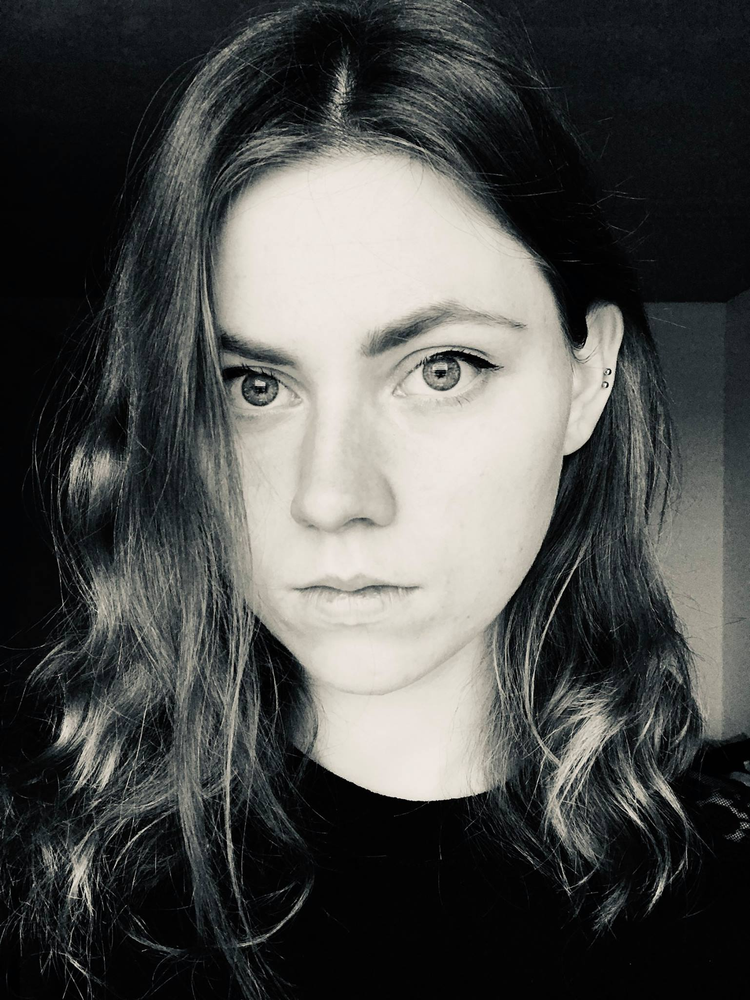

<!-- {:height="250px"} -->

 My name is Marta and I'm currently working in Computational Condensed Matter Physics Group at École Polytechnique Fédérale de Lausanne, Switzerland. I like using computers to understand the nature of electrons in crystal systems and how to perform computations in the most efficient way.

In the free time, I play the guitar and listen to 80s music.

